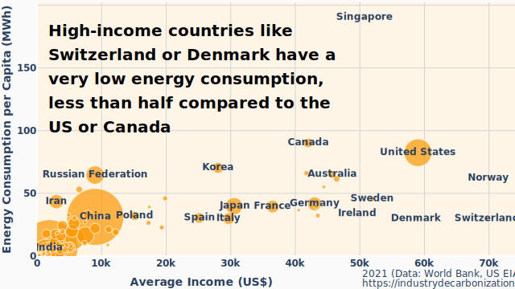

# energygraph

Code used to create infographics on energy vs. income.

[](
https://industrydecarbonization.com/news/misleading-logarithmic-scales-and-the-disregard-for-energy-efficiency.html)

For context, see: [Misleading Logarithmic Scales and the Disregard for Energy
Efficiency](
https://industrydecarbonization.com/news/misleading-logarithmic-scales-and-the-disregard-for-energy-efficiency.html)

[Interactive and zoomable versions can be found here](
https://industrydecarbonization.com/misc/incomeenergy.html).

## data

The code uses data from the World Bank (Creative Commons by-4.0) and the US EIA (public
domain). A snapshot of the data is stored in a [separate repository](
https://github.com/decarbonizenews/energygraph-data). You can download and unpack the
data to the correct path by running:

```
./getdata.sh
```

## usage examples

The python script `energygraph` will create an infographic and show it in the browser.
It has various parameters that should be largely self-explanatory.

To create the infographic used in the article:

```
./energygraph --skipsmall=5000000 --hidenames
```

To plot other values (possible are gdp, energy, electricity, income) and another year:

```
./energygraph --plotx=gdp --ploty=electricity --year=2019
```

## author

Created by [Hanno Böck](https://hboeck.de) for the [Industry Decarbonization
Newsletter](https://industrydecarbonization.com).
